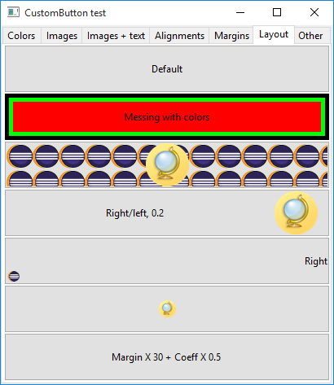

# CustomButton

A customizable SWT button.

For every state of the button (normal, hover, pressed, selected, disabled) you can change:
- background color
- border 1 and 2 color
- border 1 and 2 width
- text color
- text background color

The transitions between the various colors states are made smooth, but you can choose to make them immediate.
You can also change the duration of any transition as you like.

The default style of CustomButton resemble the standard Windows 10 button.

You can show 2 images, one on the front and one in the background, in both cases you can choose 4 different styles to display them.

If you specify a text as well as an image to display, you can organize their position in 5 different ways.
You can also specify a horizontal and vertical alignment for both the text and the image.

The button is composed of:
- CustomButton, the main project;
- a largely modified version of TextRenderer from jaretutil (v0.32), for the text wrapping functionality;
- a slightly modified version of Trident (v1.3), for smooth color transitions.

Thanks to:
- jaredutils (http://www.jaret.de/jaretutil/index.html) author Peter Kliem;
- Trident (https://kenai.com/projects/trident/pages/Home) author Kirill Grouchnikov;
- Julian Robichaux for SquareButton (https://github.com/jrobichaux/SquareButton) which I used as guideline for my CustomButton.
